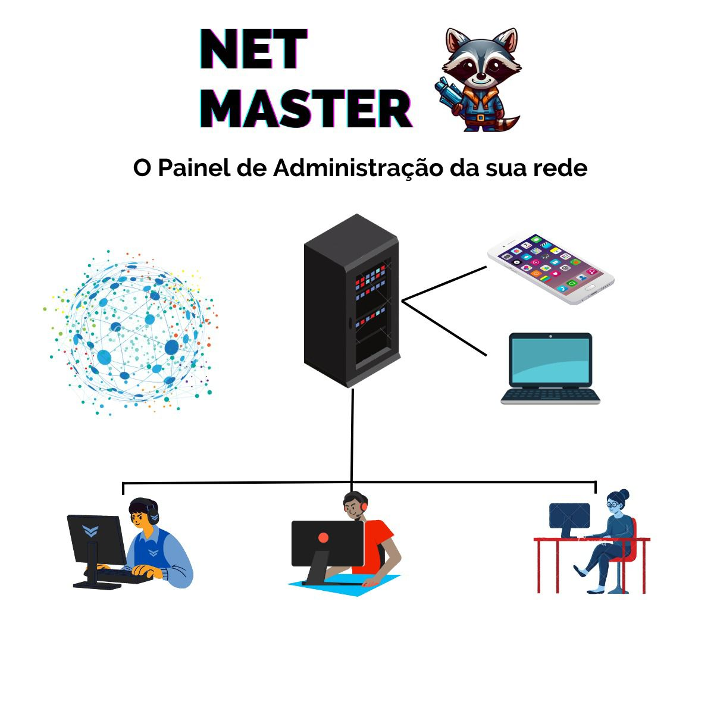
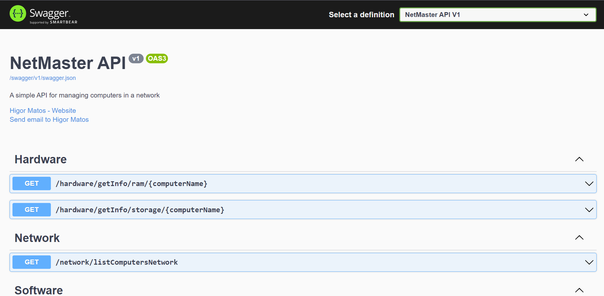
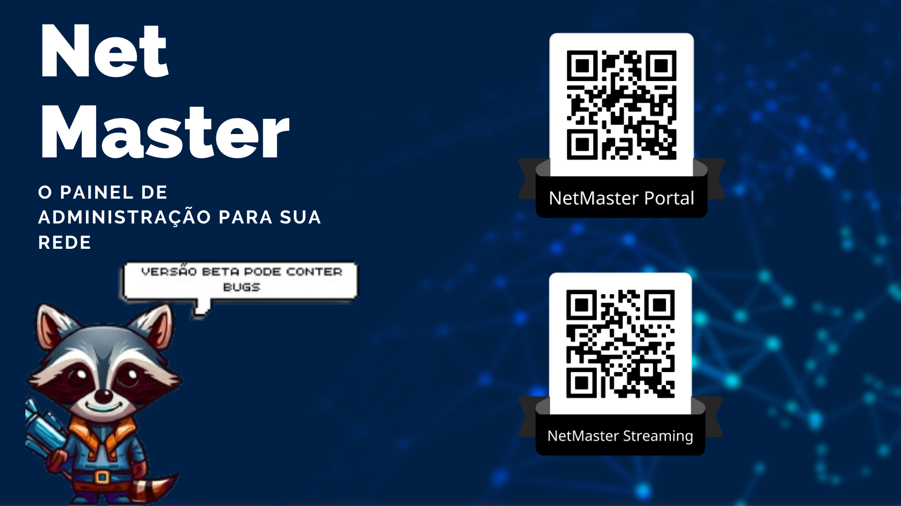

# NetMaster - Gerenciador de Rede

<p align="center">
  
</p>


NetMaster é uma poderosa aplicação de gerenciamento de rede que permite executar ações em vários computadores simultaneamente. Com recursos avançados, como desligar, instalar programas, reiniciar e compartilhar arquivos, o NetMaster simplifica o gerenciamento de redes e facilita a administração de computadores em larga escala.

## Principais Características

- Controle remoto de computadores em rede 🖥️
- Execução de ações em massa em vários computadores 🔄
- Monitoramento de recursos do sistema, como RAM e armazenamento 📊
- Armazenamento de dados em um banco de dados MongoDB 📁
- Interface de programação da Web (Web API) com suporte a .NET 6.0 🌐

## Requisitos do Sistema

- Sistema operacional: Windows, Linux ou macOS 🖥️
- Docker 🐳
- .NET 6.0 SDK 📦

## Instalação 🛠️

Siga as instruções abaixo para configurar e executar o NetMaster em seu ambiente local:

1. Clone o repositório do NetMaster do GitHub:

```bash
git clone https://github.com/seu-usuario/netmaster.git
```

2. Acesse o diretório do projeto:

```bash
cd netmaster/NetMaster.Presentation
```

4. Compile a solução do projeto:

```bash
dotnet build NetMaster.sln
```

## Instruções para execução com Docker 🐳

### Backend (MongoDB) 📦
O serviço do backend NetMaster (MongoDB) está configurado para ser executado em um contêiner Docker. Certifique-se de ter o Docker e o Docker Compose instalados em sua máquina.

Para iniciar o serviço do backend NetMaster (MongoDB), execute o seguinte comando:

```bash
docker-compose -f docker-compose-mongo.yml up
```
Isso irá iniciar o serviço do MongoDB em um contêiner Docker separado. Certifique-se de que nenhum outro serviço esteja usando a porta 27017 em seu sistema, pois ela será mapeada para a porta 27017 do host.

### Frontend + MongoDB (NetMasterFrontEnd) 🖥️
O frontend do NetMaster é executado em outro contêiner Docker separado. No momento, o backend NetMaster não está contido em um contêiner, pois faz uso de uma biblioteca exclusiva do Windows. No entanto, isso pode ser alterado no futuro para permitir que todo o ambiente seja executado em contêineres.

Para iniciar o frontend do NetMaster, execute o seguinte comando:

```bash
docker-compose -f docker-compose-frontend.yml up
```

Isso irá clonar o repositório do frontend do NetMaster a partir do GitHub e construir o contêiner necessário para executá-lo. Ele usará as configurações de volume para compartilhar os arquivos do seu diretório atual com o contêiner, permitindo que você faça alterações no código-fonte. O frontend será acessível em seu navegador através do endereço http://localhost:5173.

Certifique-se de ter o Docker e o Docker Compose instalados em sua máquina antes de executar os comandos acima.

## Uso 💡

O NetMaster oferece uma interface de programação da Web (Web API) para interagir com os computadores em rede. Você pode usar métodos HTTP, como POST, GET, PUT e DELETE, para executar várias ações nos computadores conectados.

A documentação completa da API está disponível em `http://localhost:5018/swagger` após iniciar o NetMaster.

Se desejar, você pode utilizar o front-end disponível em [NetMasterFrontEnd](https://github.com/Higor-Matos/NetMasterFrontEnd) para complementar a funcionalidade da Web API.

## 🧪 Qualidade de Software

A fim de garantir a qualidade do software, o projeto  utilizou a ferramenta Sonar. O Sonar é uma plataforma de análise estática de código que realiza verificações automatizadas para identificar problemas de qualidade, como vulnerabilidades, bugs, dívidas técnicas e violações de boas práticas de programação.

Durante o desenvolvimento, foram realizadas análises regulares com o Sonar para garantir a conformidade com os padrões de qualidade estabelecidos. As análises do Sonar forneceram insights valiosos sobre a saúde do código, permitindo a identificação de áreas de melhoria e a adoção de práticas recomendadas para o desenvolvimento de software.

## 🤝 Contribuição

Contribuições são bem-vindas! Sinta-se à vontade para abrir um "issue" ou enviar um "pull request" com melhorias, correções de bugs ou novos recursos. 🎉

## 🎙️ Entrevista sobre o projeto

Confira uma entrevista sobre este projeto no YouTube: [Entrevista - Expotech](https://www.youtube.com/watch?v=dFQMuRxyf1c)

## Imagem do Projeto

<p align="center">
  
  
  
</p>
